# Portfolio Documentation

Portfolio Website (link)
GitHub Repo (link)

## Purpose

The purpose of this website is to provide information regarding my foray into the world of software development. I aim to do this by providing information about my career/personal background, interest in tech and by demonstrating my learnt skills through the functionality and design of the website itself. The target audience of this website is potential employers and fellow developers.

## Functionality and Features

This website comprises of four main pages, not including the five blog pages accessible via the Blogs page. The design of each page is relatively minimilist so as to facilitate a smooth navigational experience for the user. Each page is fully responsive to desktop and ipad/tablet view.

All Pages: Each page contains my logo at the top of the page (which also doubles as the homepage button), links to the other pages, social media buttons directing to my social profiles and a copyright disclaimer at the bottom of the page.

Homepage: Contains my name, email/phone number and a photo of myself sitting at the computer.

About: Two paragraphs briefly outlining my work background, interest in software development and personal hobbies outside of tech. Each paragraph is seperated by a photo of me hiking.

Projects: Details that no projects are currently available. This page also has a "not available" image.

Blogs: Img links directing the user to each blog. Underneath each link is the title of the blog. 

Blog pages: Contains contents of blog article with a picture in the middle.

## Sitemap

## Wireframes/Screenshots

### Homepage

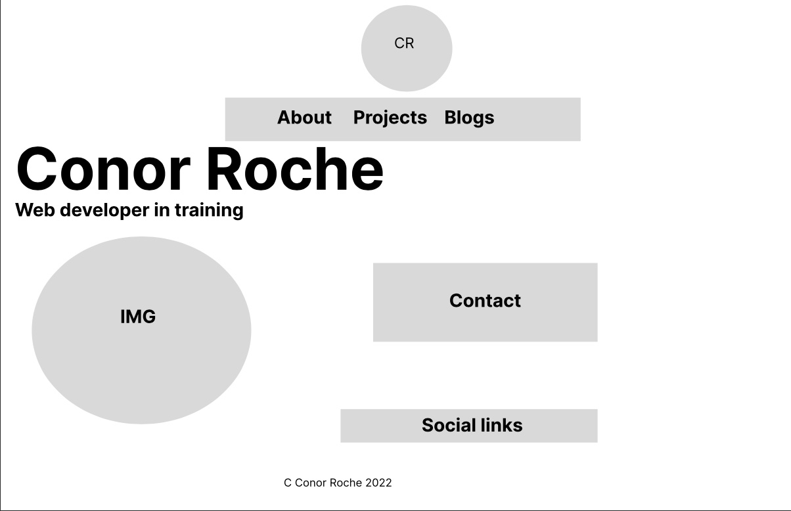

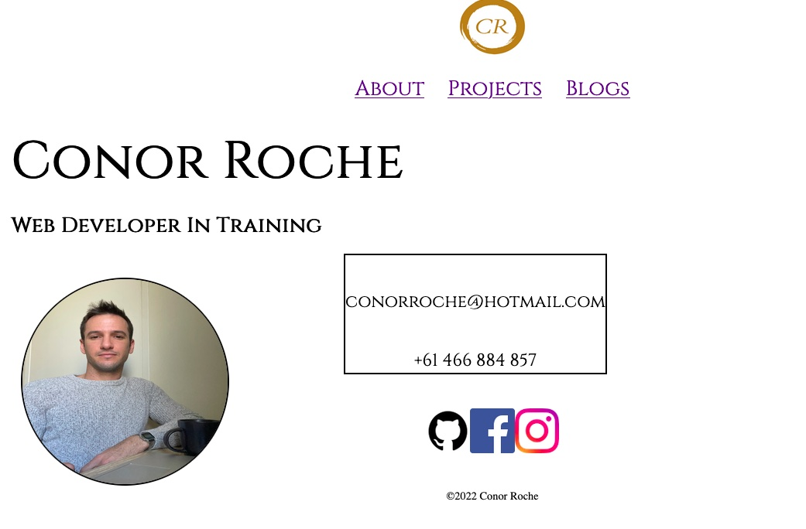

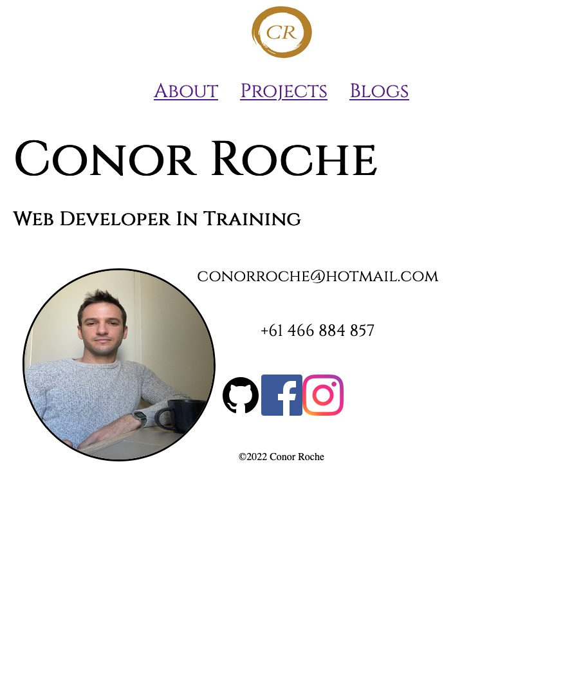

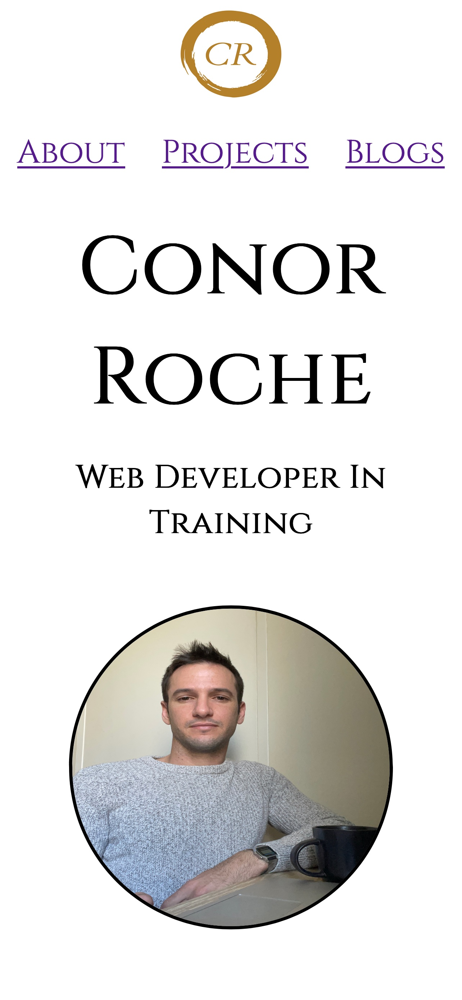

### About 
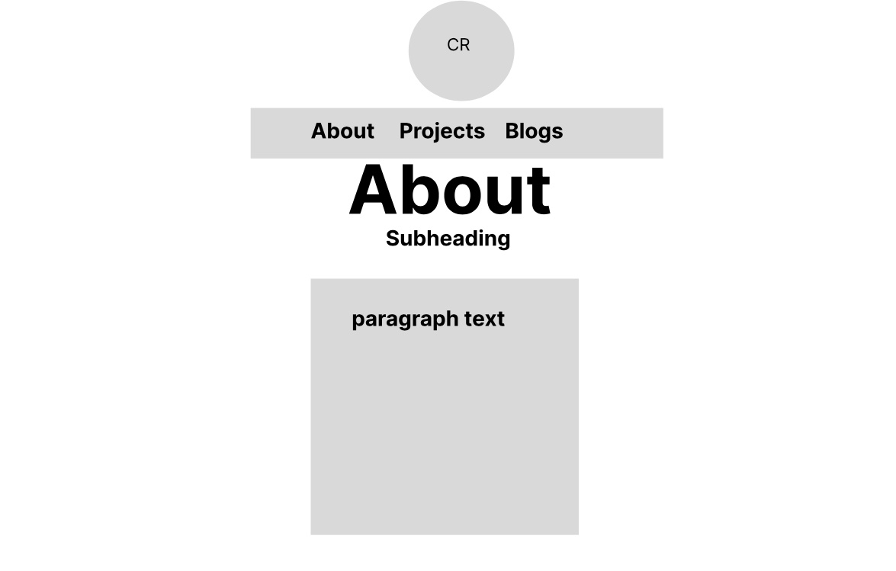
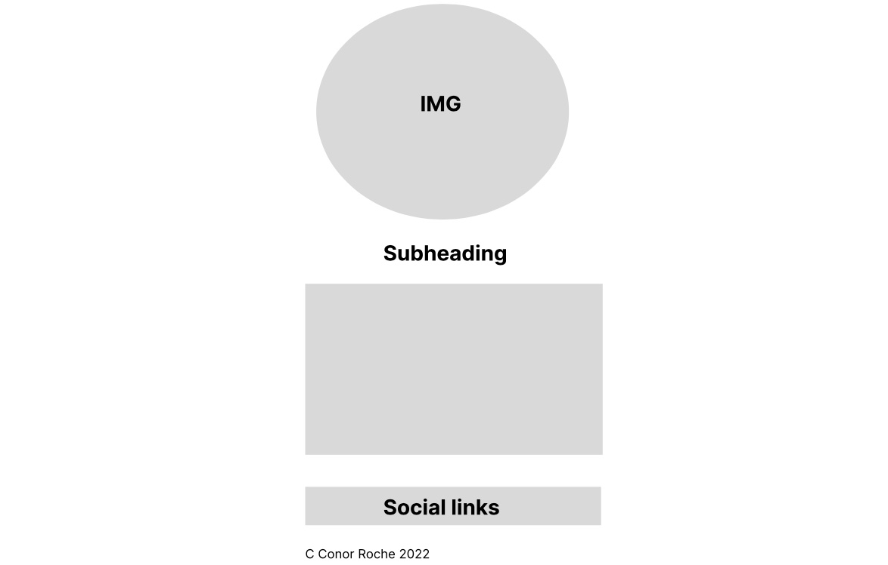
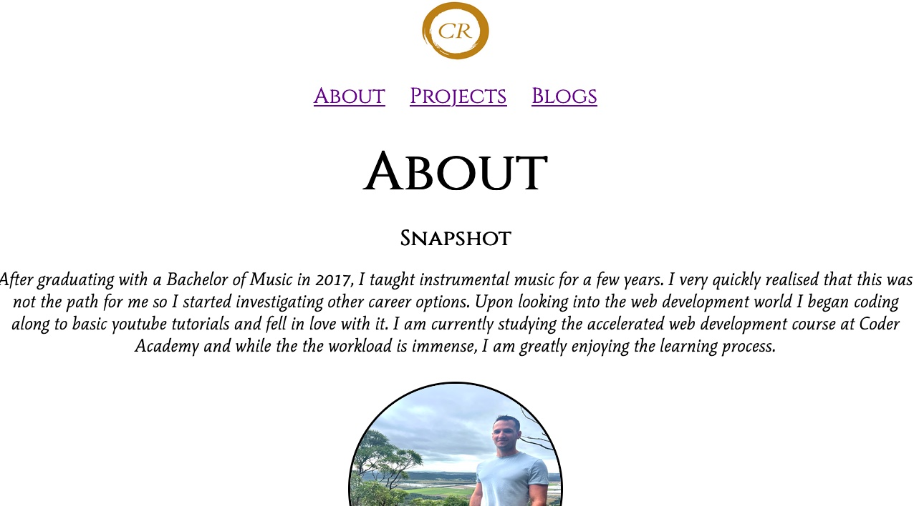
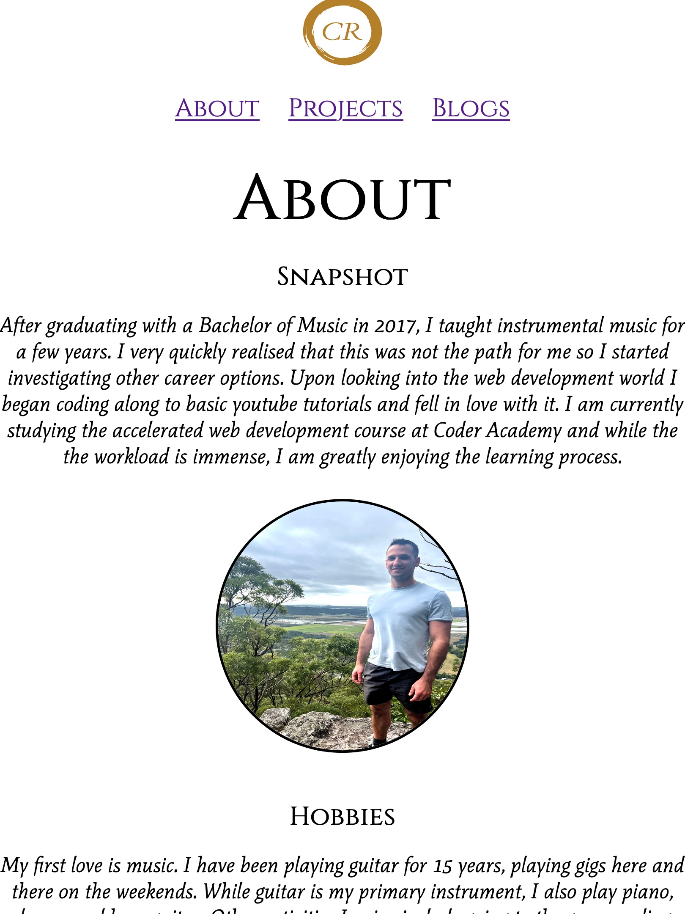

### Projects
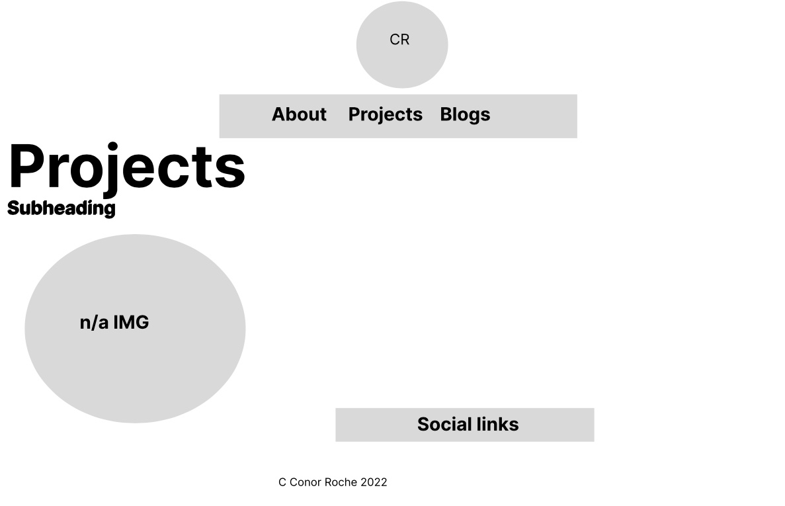

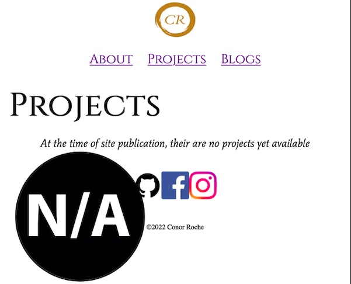
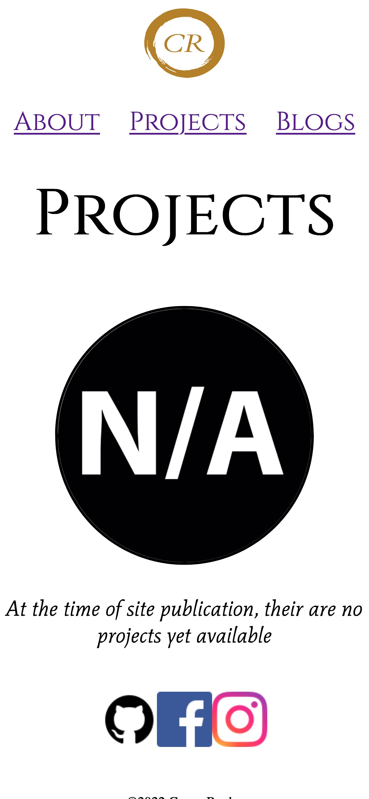

### Blogs

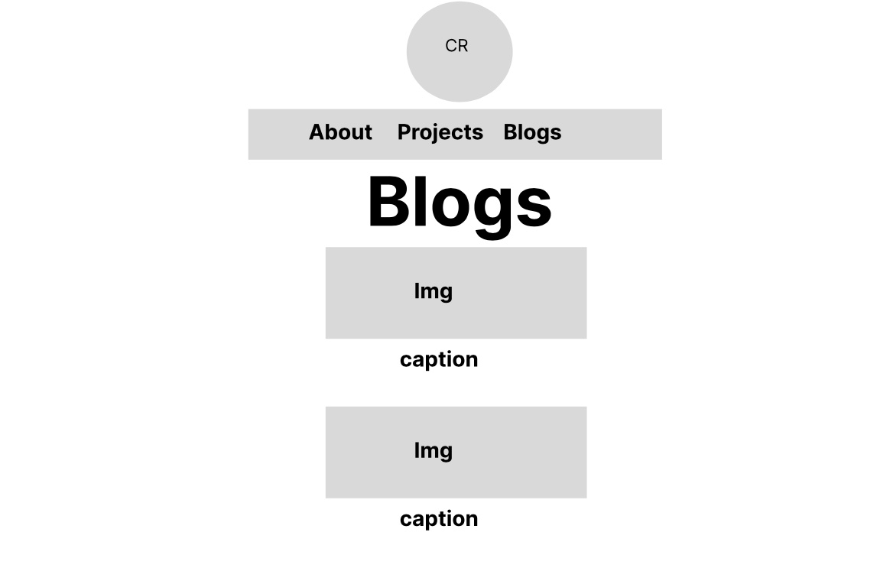
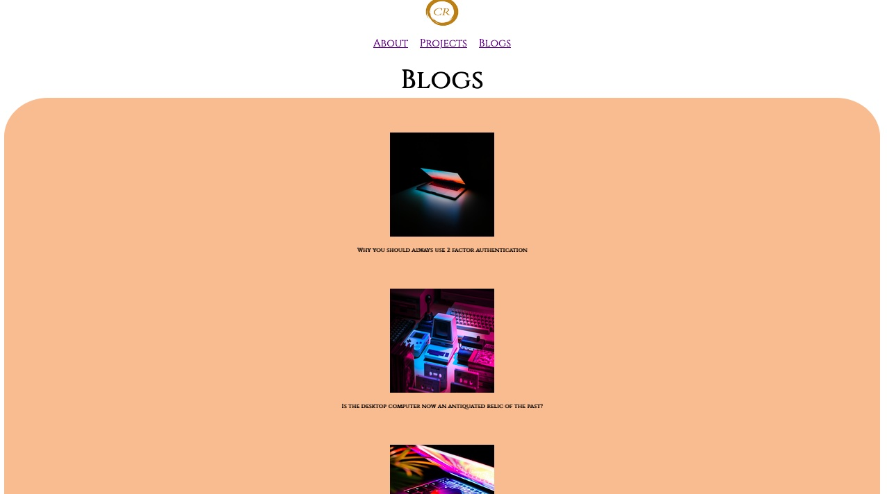
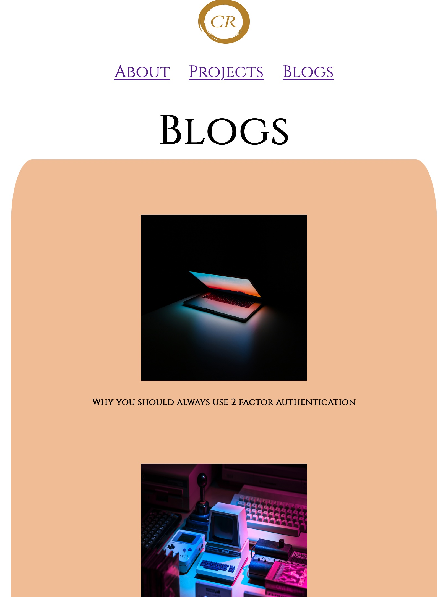
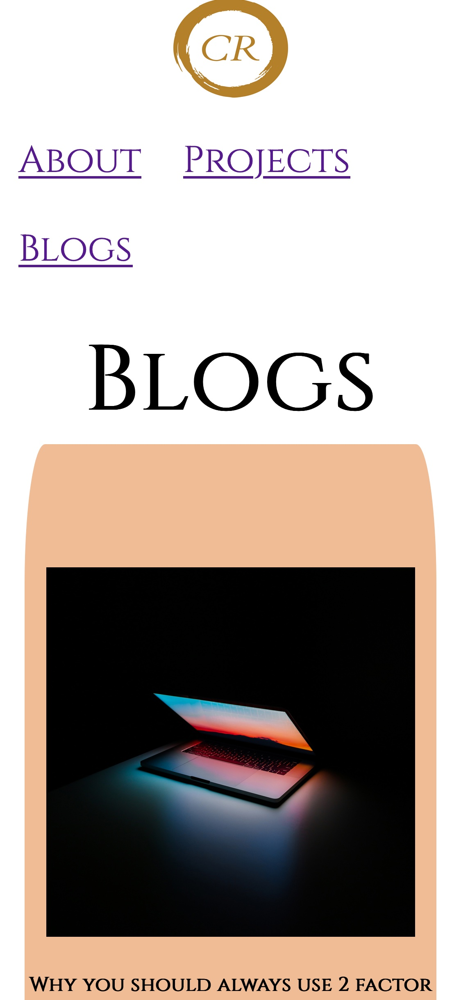

### Blog Page

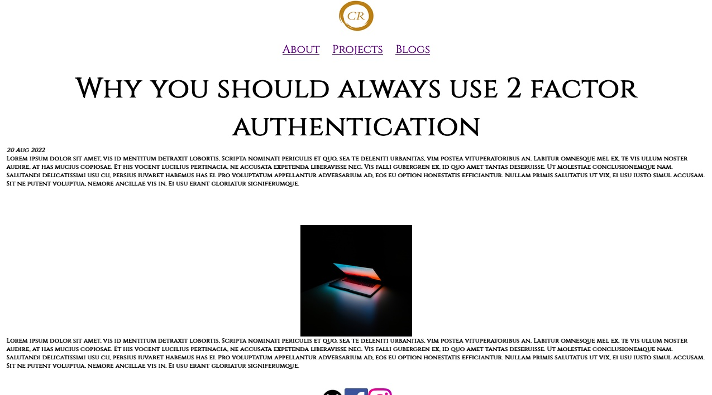

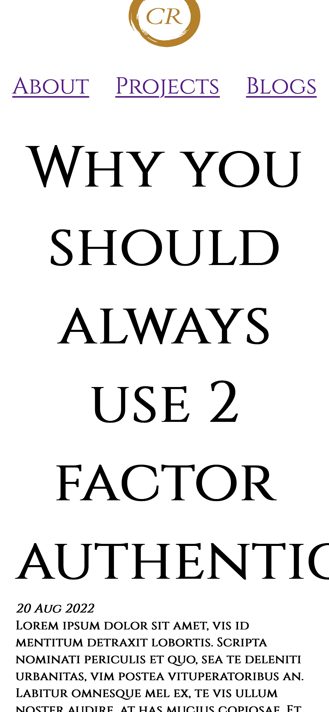

### Tech Stack

CSS, HTML, Figma, 
